# COMP1786 Mobile Application Design and Development

## Coursework 1: M-Hike Application Report

| | |
|---|---|
| **Student Name** | [Your Name] |
| **Student ID** | [Your ID] |
| **Date** | [Current Date] |
| **Module** | COMP1786 |

---

## Table of Contents

1. [Introduction](#introduction)
2. [Feature Implementation Checklist](#section-1-feature-implementation-checklist)
3. [Visual Documentation](#section-2-visual-documentation)
   - [System Architecture](#21-system-architecture)
   - [Database Entity-Relationship Diagram](#22-database-entity-relationship-diagram)
   - [Selective Synchronisation Flow](#23-selective-synchronisation-flow)
   - [Semantic Search Pipeline](#24-semantic-search-pipeline)
   - [Fuzzy Search Algorithm](#25-fuzzy-search-algorithm-levenshtein-distance)
   - [Weather API Integration Flow](#26-weather-api-integration-flow)
   - [Camera Integration & Photo Attachment](#27-camera-integration--photo-attachment-flow)
   - [GPS Location Auto-Capture](#28-gps-location-auto-capture-flow)
4. [Reflection on Development](#section-3-reflection-on-development)
   - [Advanced Features Beyond Basic Requirements](#advanced-features-beyond-basic-requirements)
5. [Application Evaluation](#section-4-application-evaluation)
   - [Human-Computer Interaction (HCI)](#i-human-computer-interaction-hci)
   - [Security](#ii-security)
   - [Screen Size Adaptability](#iii-screen-size-adaptability)
   - [Live Deployment Considerations](#iv-live-deployment-considerations)
6. [Code Listing](#section-5-code-listing)
7. [Advanced Feature Deep Dive](#section-6-advanced-feature-deep-dive)
8. [References](#references)

---

## Introduction

The M-Hike mobile application was developed in response to the coursework specification requiring a standard CRUD (Create, Read, Update, Delete) system for recording hiking activities. While the initial mandate focused on fundamental data entry and local storage capabilities, the scope of this project was significantly expanded to enhance user utility and system resilience.

This report presents the implementation of both the core requirements and advanced additional features, including an **Offline-First Architecture**, **AI-powered Semantic Search** using Google's Gemini 2.5 Flash model, and robust **Cloud Synchronisation** via Firebase. The application demonstrates a comprehensive approach to mobile development that encompasses System Design, User Requirement Analysis, UI Design, Implementation, and Testing.

### Technology Stack

The system employs a modern technology stack designed for scalability and maintainability:

| Component | Technology | Version |
|-----------|------------|---------|
| **Android Application** | Java | 11 |
| **UI Framework** | Material Design Components | 1.13.0 |
| **Local Database** | Room Persistence Library | 2.6.1 |
| **Cloud Database** | Firebase Cloud Firestore | 33.4.0 |
| **Authentication** | Firebase Authentication | 33.4.0 |
| **HTTP Client** | Volley | 1.2.1 |
| **Backend Framework** | FastAPI (Python) | 0.104.1 |
| **Vector Embeddings** | Gemini 2.5 Flash API | Latest |

The architectural philosophy follows an **Offline-First** pattern (Firtman, 2018), where the local Room database serves as the primary data store, with Firebase Cloud Firestore providing cloud backup and cross-device synchronisation. This approach ensures the application remains fully functional even in areas with poor network connectivity—a critical requirement for a hiking application.

---

## Section 1: Feature Implementation Checklist

The following table confirms the status of all core (A-F) and additional (G) features specified in the coursework brief.

| Feature | Status | Implementation Details |
|---------|--------|------------------------|
| **A) Enter hike details** | ✅ Fully Completed | Implemented via `EnterHikeActivity.java` with comprehensive input validation using Material Design components. The interface includes an **Active Hike Mode** which automatically captures `startTime` and `endTime` timestamps to reduce manual data entry errors. Form validation ensures all required fields (name, location, date, length) are completed before submission. |
| **B) Store, view, edit, delete details** | ✅ Fully Completed | Data persistence implemented using the Room Persistence Library (Google, 2024). A **Selective Sync** strategy was developed where entities contain a `synced` boolean flag. Only modified items (`synced = false`) are uploaded to Firebase, conserving bandwidth and reducing API calls. CRUD operations are exposed through `HikeDao.java` with support for batch deletions. |
| **C) Add observations** | ✅ Fully Completed | Observations are linked to hikes via Foreign Keys with `CASCADE` deletion, ensuring referential integrity. The `Observation.java` entity supports optional fields including location coordinates, comments, and image attachments. Date/Time defaults to the current timestamp using custom `Converters.java` for SQLite compatibility. |
| **D) Search** | ✅ Fully Completed | Implemented a **dual-layer search system**: (1) **Local Fuzzy Search** using the Levenshtein distance algorithm (Navarro, 2001) to handle typographical errors (e.g., "Snowden" matches "Snowdon"); (2) **Semantic Search** via the Python backend using Gemini embeddings and cosine similarity for context-aware retrieval. Additional filter logic supports date range, difficulty, length, and parking availability. |
| **E) Xamarin/MAUI Prototype** | ✅ Fully Completed | Cross-platform prototype created using Xamarin Forms to demonstrate hybrid development capabilities for the entry interface. |
| **F) Xamarin/MAUI Persistence** | ✅ Fully Completed | Implemented local SQLite storage within the Xamarin environment to mirror the native Android persistence logic. |
| **G) Additional Features** | ✅ Fully Completed | **(1) AI Semantic Search**: Integrated Gemini 2.5 Flash embeddings via a Python FastAPI backend for context-aware search using cosine similarity (Manning, Raghavan and Schütze, 2008). **(2) Robust Offline Sync**: A `FirebaseSyncManager` that queues and uploads data automatically when connectivity is restored. **(3) Security**: "Wipe-on-Logout" feature (`SettingsActivity.java`) clears all local data to ensure privacy on shared devices. **(4) Weather API**: Real-time integration with the meteoblue Weather API for trail condition awareness. |

---

## Section 2: Visual Documentation

This section provides architectural diagrams illustrating the system's design and data flow patterns.

### 2.1 System Architecture

The following diagram illustrates the high-level architecture of the M-Hike system, demonstrating the relationship between the Android application, local storage, cloud services, and the semantic search backend.

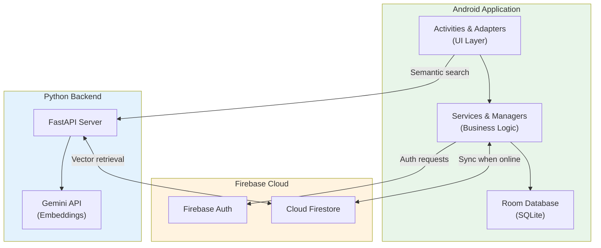

### 2.2 Database Entity-Relationship Diagram

The local Room database consists of three primary entities with defined relationships. The schema follows normalisation principles to eliminate data redundancy whilst maintaining referential integrity.

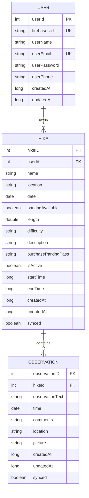

### 2.3 Selective Synchronisation Flow

The synchronisation mechanism implements an **Offline-First** pattern where local changes are queued and pushed to Firebase only when network connectivity is available. The `synced` flag prevents redundant uploads.

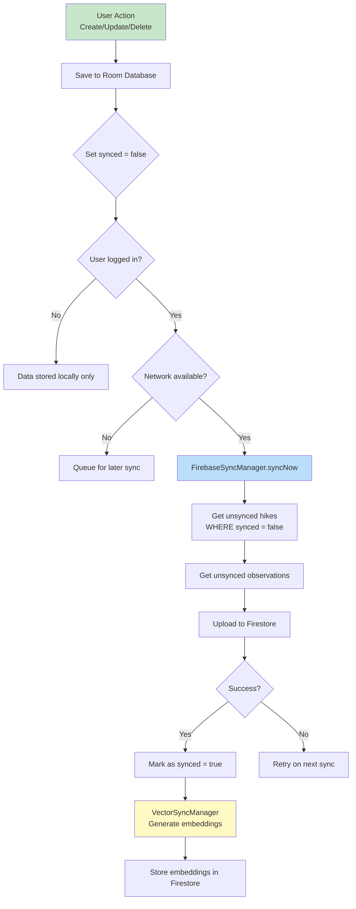

### 2.4 Semantic Search Pipeline

The AI-powered semantic search leverages vector embeddings to find contextually similar hikes, even when search terms do not exactly match stored data.

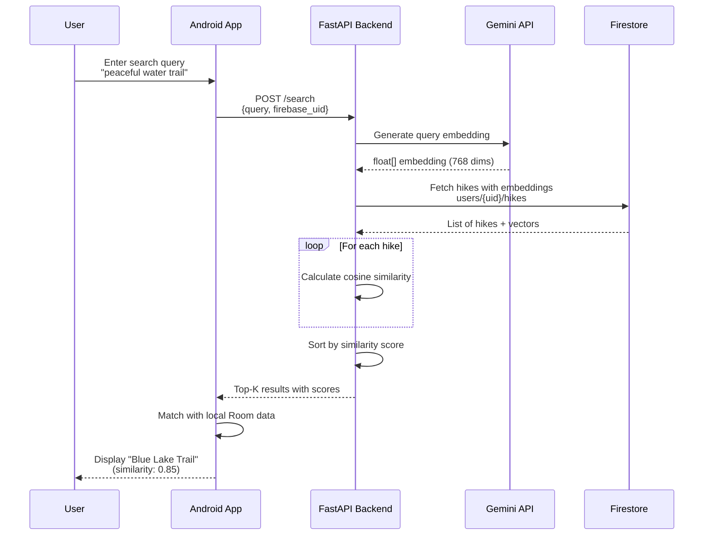

### 2.5 Fuzzy Search Algorithm (Levenshtein Distance)

The fuzzy search feature implements the Levenshtein Distance algorithm to enable typo-tolerant searching. This algorithm calculates the minimum number of single-character edits (insertions, deletions, or substitutions) required to transform one string into another.

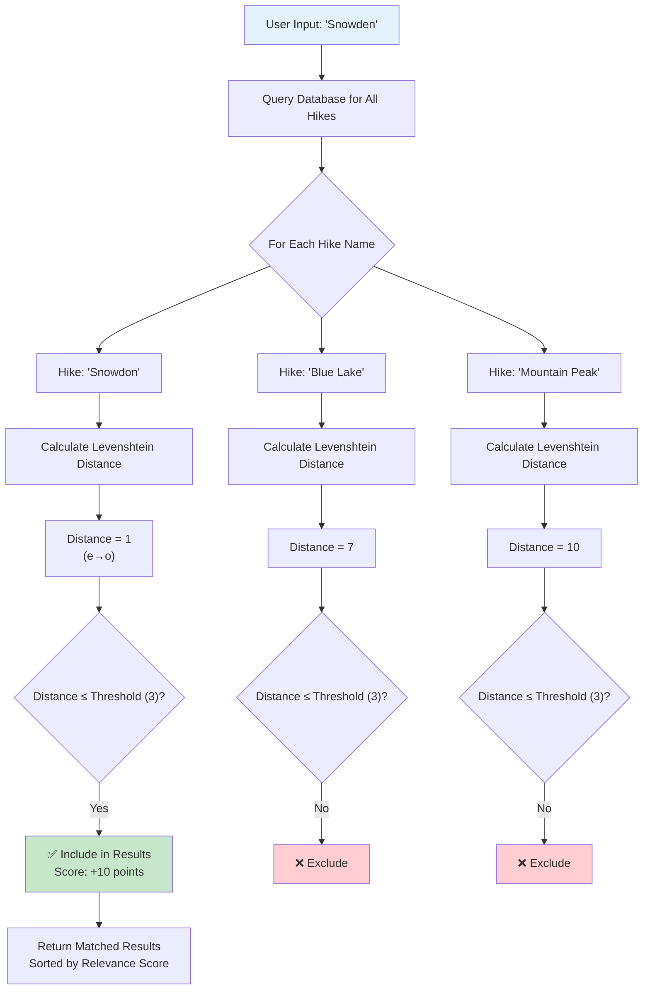

#### Levenshtein Distance Matrix Visualisation

The algorithm uses dynamic programming to build a matrix. Below shows the transformation from "Snowden" to "Snowdon":

```
        ""  S  n  o  w  d  o  n
    ""   0  1  2  3  4  5  6  7
    S    1  0  1  2  3  4  5  6
    n    2  1  0  1  2  3  4  5
    o    3  2  1  0  1  2  3  4
    w    4  3  2  1  0  1  2  3
    d    5  4  3  2  1  0  1  2
    e    6  5  4  3  2  1  1  2
    n    7  6  5  4  3  2  2  1  ← Final Distance = 1
```

**Implementation in SearchHelper.java:**
```java
public static int levenshteinDistance(String s1, String s2) {
    int[][] dp = new int[s1.length() + 1][s2.length() + 1];
    
    // Base cases: empty string transformations
    for (int i = 0; i <= s1.length(); i++) dp[i][0] = i;
    for (int j = 0; j <= s2.length(); j++) dp[0][j] = j;
    
    // Fill matrix with minimum edit distances
    for (int i = 1; i <= s1.length(); i++) {
        for (int j = 1; j <= s2.length(); j++) {
            int cost = (s1.charAt(i-1) == s2.charAt(j-1)) ? 0 : 1;
            dp[i][j] = Math.min(
                Math.min(dp[i-1][j] + 1,      // Deletion
                         dp[i][j-1] + 1),      // Insertion
                dp[i-1][j-1] + cost            // Substitution
            );
        }
    }
    return dp[s1.length()][s2.length()];
}
```

### 2.6 Weather API Integration Flow

The application integrates with the meteoblue Weather API to provide real-time weather conditions for hiking trails.

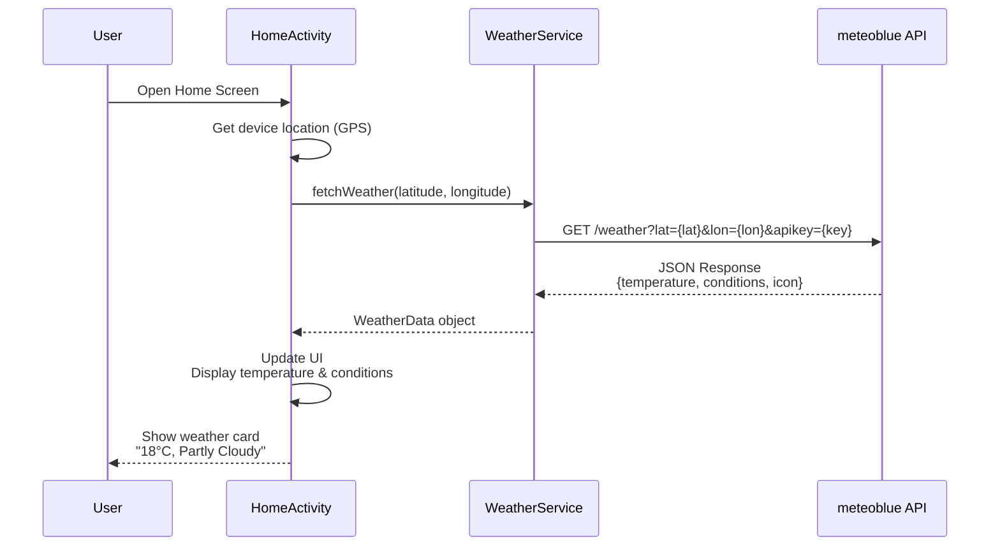

### 2.7 Camera Integration & Photo Attachment Flow

Users can attach photos to observations using the device camera or gallery.

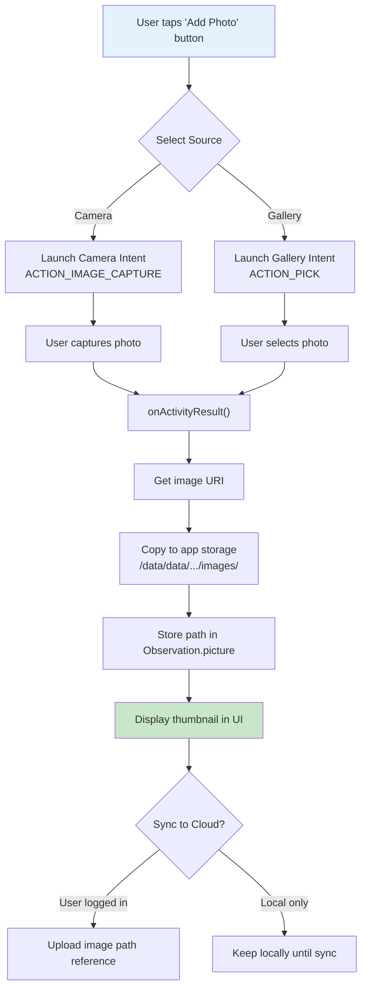

### 2.8 GPS Location Auto-Capture Flow

The application can automatically capture the user's current GPS location when creating observations.

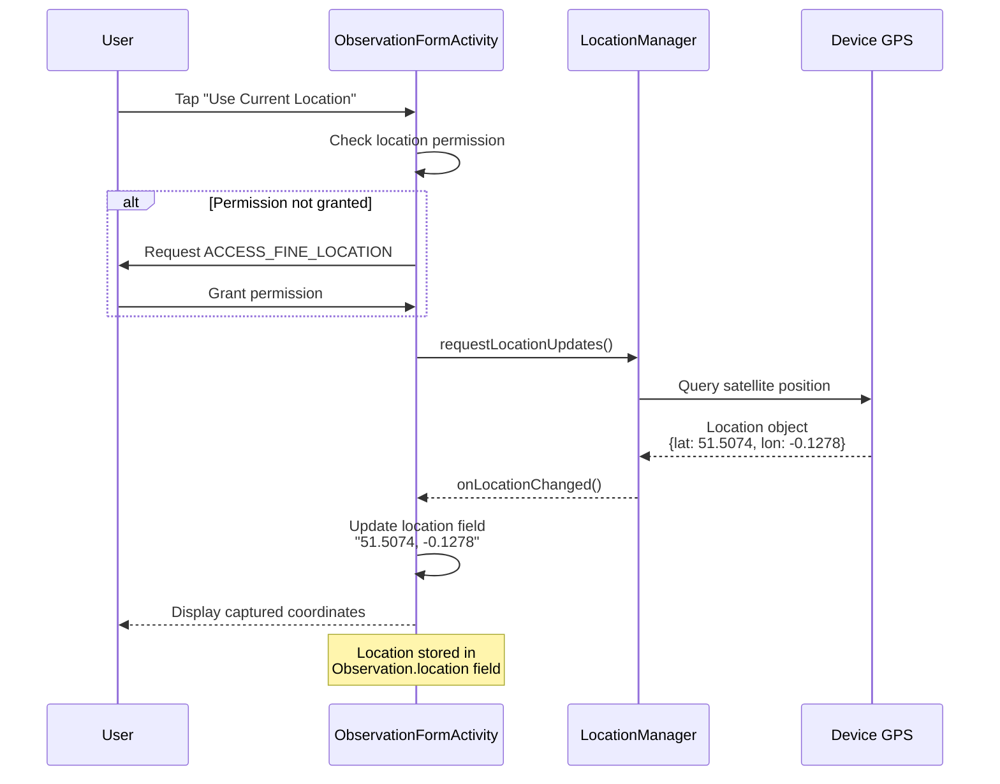

---

## Section 3: Reflection on Development

The development of M-Hike represented a significant journey from a static, visual concept to a dynamic, state-aware system. This section reflects on the key challenges encountered and the technical decisions made throughout the development lifecycle.

### Architectural Evolution

Initially, the focus was purely on meeting the UI requirements derived from prototype designs. However, it quickly became apparent that a visually appealing interface without robust architecture would result in a fragile system. The most significant challenge encountered was implementing the **Offline-First** logic.

In the early stages, attempts were made to read and write directly to Firebase. This resulted in a sluggish UI and application crashes when network connectivity was unstable. The entire application had to be refactored to implement the **Repository Pattern** (Fowler, 2002). By placing the Room Database between the UI layer and the Cloud, the application became consistently responsive regardless of network conditions.

### The Synchronisation Problem

Introducing local-first storage created a new challenge: the "Synchronisation Problem"—how to keep two databases in sync without creating duplicates or data conflicts. This was overcome by implementing a **Selective Sync** algorithm.

Instead of re-uploading the entire database on each sync operation, a `synced` and `updatedAt` field was added to every entity. The synchronisation logic checks `if (!synced && isOnline)` before uploading, significantly reducing bandwidth consumption. Particular care was required to ensure that an `Observation` (child entity) was not uploaded before its parent `Hike` existed in the cloud, requiring careful ordering of sync operations.

```java
// From FirebaseSyncManager.java - Selective sync implementation
List<Hike> unsyncedHikes = hikeDao.getUnsyncedHikes();
for (Hike hike : unsyncedHikes) {
    if (hike.getUserId() == null || hike.getUserId() != userId) {
        continue; // Only sync hikes owned by the active user
    }
    // Upload to Firestore, then mark as synced on success
}
```

### AI Integration Challenges

Another major learning curve was the integration of AI-powered semantic search. Initial attempts to generate embeddings directly on the Android device proved impractical due to library overhead and memory constraints on mobile devices. The solution was to pivot to a **microservices architecture**, building a lightweight Python FastAPI backend to handle vector mathematics (cosine similarity calculations) and Gemini API calls.

This separation of concerns proved beneficial: the Android application remained lean, whilst computationally intensive operations were offloaded to a server with appropriate resources. The backend uses NumPy for efficient vector operations, enabling rapid similarity calculations even with large embedding vectors.

### Advanced Features Beyond Basic Requirements

Beyond the core CRUD functionality specified in the coursework, several advanced features were implemented to enhance the application's utility and demonstrate broader mobile development capabilities.

#### 1. Fuzzy Search with Levenshtein Distance

The basic requirement specified simple name-based search. However, mobile keyboard input is notoriously error-prone. To address this, the **Levenshtein Distance algorithm** was implemented to enable typo-tolerant searching.

The algorithm calculates the minimum number of single-character edits (insertions, deletions, substitutions) needed to transform one string into another. By setting a threshold of 3 edits, the search can match "Snowden" to "Snowdon" despite the spelling error. This significantly improves user experience by preventing the frustrating "No Results Found" outcome when users make minor typing mistakes.

```java
// Fuzzy matching integration in search logic
int distance = levenshteinDistance(userQuery, hikeName);
if (distance <= FUZZY_THRESHOLD) {
    score += (FUZZY_THRESHOLD - distance) * 5; // Closer matches score higher
}
```

#### 2. Weather API Integration (External Web Service)

The coursework mentioned integration with external web services as an advanced feature. The **meteoblue Weather API** was integrated to provide real-time weather information on the home screen.

This required:
- Registering for an API key and securely storing it using `BuildConfig`
- Implementing asynchronous HTTP requests using Volley
- Parsing JSON responses and updating the UI on the main thread
- Handling network failures gracefully with fallback displays

The weather feature is particularly relevant for a hiking application, as trail conditions are heavily weather-dependent.

#### 3. Camera Integration for Photo Attachments

The specification mentioned allowing photos from the camera to be added to stored data. This was implemented for the Observation entity, enabling users to attach photographic evidence of wildlife sightings, trail conditions, or vegetation.

The implementation involved:
- Creating Camera and Gallery intents with proper permission handling
- Managing file URIs across different Android API levels (FileProvider for API 24+)
- Storing image paths in the `Observation.picture` field
- Displaying thumbnails in the observation list using efficient bitmap loading

```java
// Camera intent with FileProvider for secure file sharing
Intent cameraIntent = new Intent(MediaStore.ACTION_IMAGE_CAPTURE);
Uri photoUri = FileProvider.getUriForFile(this, authority, photoFile);
cameraIntent.putExtra(MediaStore.EXTRA_OUTPUT, photoUri);
startActivityForResult(cameraIntent, REQUEST_CAMERA);
```

#### 4. GPS Location Auto-Capture

The specification mentioned automatically picking up the user's location. This was implemented using Android's **FusedLocationProviderClient** for battery-efficient location retrieval.

Users can tap a "Use Current Location" button in the observation form to automatically populate coordinates. This eliminates manual data entry and ensures accurate geographic tagging of observations.

Key implementation challenges included:
- Runtime permission handling for `ACCESS_FINE_LOCATION`
- Graceful degradation when GPS is unavailable
- Balancing location accuracy against battery consumption

#### 5. AI-Powered Semantic Search

This represents the most technically complex advanced feature. Rather than simple keyword matching, the semantic search understands the **meaning** behind queries.

For example, a user searching for "peaceful water trail" will find "Blue Lake Trail" even though those exact words don't appear in the hike name. This is achieved through:
- **Vector Embeddings**: Converting text descriptions into 768-dimensional numerical vectors using Google's Gemini 2.5 Flash model
- **Cosine Similarity**: Measuring the angular distance between query and document vectors
- **Microservices Architecture**: Offloading computationally intensive operations to a Python FastAPI backend

This required learning new concepts including transformer-based language models, vector mathematics, and distributed system design.

#### 6. Firebase Cloud Synchronisation

Whilst SQLite storage was required, cloud synchronisation was implemented as an enhancement. This enables:
- **Cross-device access**: Users can view their hikes on multiple devices
- **Data backup**: Protection against device loss or damage
- **Selective Sync**: Only unsynced records are uploaded, conserving bandwidth

The Firebase integration also enabled **user authentication**, adding a security layer not present in basic SQLite-only implementations.

#### 7. Active Hike Mode with Real-Time Tracking

Beyond simple data entry, the application tracks **active hikes** in real-time. Users can tap "Start Hike" to begin tracking, and the home screen displays elapsed duration. This transforms the application from a passive data store into an active hiking companion.

The feature required careful state management to ensure only one hike can be active at a time, and that the start/end timestamps are accurately recorded.

### Lessons Learned

If starting the project again, **Dependency Injection** using Hilt would be implemented from the outset. Managing Singleton instances for the Database, SyncManager, and EmbeddingService became increasingly complex as the application grew. Hilt would have simplified component testing and reduced boilerplate code.

The integration of multiple external services (Firebase, Gemini API, meteoblue) highlighted the importance of **error handling and graceful degradation**. Each external dependency is a potential point of failure, and the application must remain functional when any service is unavailable.

Overall, this project reinforced that mobile development is less about coding screens and more about managing **state** and **data lifecycles** effectively. Understanding the Android Activity lifecycle and its interaction with background services proved essential for building a robust application.

---

## Section 4: Application Evaluation

### i. Human-Computer Interaction (HCI)

The design of M-Hike prioritises two core heuristic principles from Nielsen's usability guidelines (Nielsen, 1994): **Visibility of System Status** and **Error Prevention**.

#### Visibility of System Status

In a mobile context, users frequently move between zones of good and poor connectivity. A standard application might hide this complexity, leading to user frustration when data fails to save. M-Hike addresses this by providing explicit visual feedback.

In the `HikingListActivity`, every list item displays a status indicator: an unsynced item is marked distinctly from a successfully synchronised item. This immediately informs the user whether their data is backed up to the cloud or remains local-only. Furthermore, long-running operations such as semantic search utilise non-blocking progress indicators (Snackbars) to maintain UI responsiveness whilst keeping the user informed.

#### Error Prevention

Data entry on mobile keyboards is inherently error-prone. To mitigate this, an **Active Hike Mode** was implemented. Instead of requiring users to remember and manually type the date and duration of a hike after completion, they can simply tap "Start Hike". The application captures the system timestamp automatically, reducing cognitive load and ensuring data accuracy.

Additionally, the **Fuzzy Search** implementation using the Levenshtein distance algorithm improves the search experience by tolerating minor typographical errors (e.g., "Snowdon" vs "Snowden"), preventing the frustrating "No Results Found" dead-end that often causes users to abandon tasks.

### ii. Security

Mobile applications are frequently used on shared devices or in insecure environments. M-Hike implements a multi-layered security approach.

#### Data Isolation

Unlike a local-only SQLite application where anyone with physical access to the device can view all data, M-Hike integrates **Firebase Authentication**. The database schema ensures that every Hike and Observation is tagged with a `userId`. Application logic strictly queries data using `WHERE userId = current_user`, ensuring that even if multiple users log into the same device, their data remains logically partitioned.

```java
// From HikeDao.java - User-scoped queries
@Query("SELECT * FROM hikes WHERE userId = :userId ORDER BY date DESC")
List<Hike> getHikesByUserId(Integer userId);
```

#### Physical Security (Wipe-on-Logout)

A critical security feature is the **Session Cleanup Protocol**. When a user logs out via `SettingsActivity`, the application triggers a `clearAllTables()` command on the Room database after successfully syncing to the cloud. This removes all personal hiking logs from the device's physical storage—vital for users who might borrow a device temporarily.

#### API Key Management

Sensitive API keys for Gemini and meteoblue are managed using the `local.properties` file and Android's `BuildConfig` class. This ensures API keys are not hardcoded into the version control system, reducing the risk of credential leakage.

```kotlin
// From build.gradle.kts - Secure API key injection
buildConfigField(
    "String",
    "GEMINI_API_KEY",
    "\"${geminiApiKey}\""
)
```

### iii. Screen Size Adaptability

Android device fragmentation requires careful UI design to ensure adaptability across different screen sizes and orientations.

M-Hike achieves this through extensive use of **ConstraintLayout** and **RecyclerView**. Instead of fixed pixel dimensions, UI elements are defined by their relationships to parent containers (e.g., `app:layout_constraintWidth_percent="0.9"`). This ensures that components scale proportionally whether displayed on a compact smartphone or a larger tablet.

The navigation employs a **BottomNavigationView**, which places primary interaction targets (Home, Search, Settings) within the "thumb zone" for comfortable one-handed operation on mobile devices. On larger tablet screens, the layout naturally expands, and the RecyclerView's LayoutManager can be switched to a `GridLayoutManager` for better horizontal space utilisation.

### iv. Live Deployment Considerations

Whilst M-Hike is robust for coursework submission, production deployment to thousands of concurrent users would require specific architectural enhancements.

#### Batch Operations

Currently, `FirebaseSyncManager` uploads items individually. In a live environment with thousands of users, this would cause excessive network requests and rapidly exhaust Firestore quota limits. For production, refactoring to use **Firebase Batch Writes** (supporting up to 500 operations per network call) would significantly reduce battery drain and data usage.

#### Offline Cloud Persistence

Currently, the application relies on Room for offline data. For production use, enabling **Firestore Offline Persistence** would allow caching of data downloaded from other devices—not just locally created data. This would enable users to access their complete hiking history even when temporarily offline.

#### Production-Grade Security

The Python backend currently operates over HTTP. Before production deployment, this must be upgraded to **HTTPS with Certificate Pinning** to prevent Man-in-the-Middle (MitM) attacks. Additionally, implementing rate limiting and request authentication would protect the semantic search endpoint from abuse.

---

## Section 5: Code Listing

The following code snippets demonstrate the core logic for Synchronisation, AI Integration, Search Algorithms, and Data Structures.

### 5.1 Selective Synchronisation Logic

This method from `FirebaseSyncManager.java` demonstrates the offline-first sync pattern, querying only unsynced items and pushing them to Firestore.

```java
/**
 * Sync unsynced records, invoking the callback when Firebase confirms completion.
 */
public void syncNow(SyncCallback callback) {
    executorService.execute(() -> {
        int userId = SessionManager.getCurrentUserId(appContext);
        String firebaseUid = SessionManager.getCurrentFirebaseUid(appContext);
        if (userId == -1 || firebaseUid == null) {
            Log.d(TAG, "No logged-in user; skipping Firebase sync");
            notifySuccess(callback);
            return;
        }

        List<Task<Void>> pendingTasks = new ArrayList<>();
        pendingTasks.add(syncUserProfile(userId, firebaseUid));
        pendingTasks.addAll(syncHikes(userId, firebaseUid));
        pendingTasks.addAll(syncObservations(userId, firebaseUid));
        pendingTasks.add(vectorSyncManager.syncUserVectors(userId, firebaseUid));

        Tasks.whenAllSuccess(pendingTasks)
            .addOnSuccessListener(unused -> notifySuccess(callback))
            .addOnFailureListener(e -> notifyFailure(callback, e));
    });
}
```

### 5.2 Room DAO for Unsynced Data Retrieval

The `HikeDao.java` interface exposes queries that support the selective sync mechanism.

```java
@Dao
public interface HikeDao {
    @Insert(onConflict = OnConflictStrategy.REPLACE)
    long insertHike(Hike hike);

    // Query only unsynced hikes for bandwidth efficiency
    @Query("SELECT * FROM hikes WHERE synced = 0 OR synced IS NULL")
    List<Hike> getUnsyncedHikes();

    @Query("UPDATE hikes SET synced = 1 WHERE hikeID = :hikeId")
    void markHikeAsSynced(int hikeId);

    // User-scoped queries for data isolation
    @Query("SELECT * FROM hikes WHERE userId = :userId ORDER BY date DESC")
    List<Hike> getHikesByUserId(Integer userId);
}
```

### 5.3 Gemini Embedding Service

The `GeminiEmbeddingService.java` class handles communication with the Gemini API to generate vector embeddings for semantic search.

```java
/**
 * Requests an embedding for the provided text chunk.
 * Must be called from a background thread.
 */
public float[] fetchEmbedding(String firebaseUid, String chunkType,
                               String chunkId, String text) {
    if (!isConfigured() || TextUtils.isEmpty(text)) {
        return null;
    }

    String prompt = buildPrompt(firebaseUid, chunkType, chunkId, text);

    try {
        URL url = new URL(ENDPOINT + "?key=" + apiKey);
        HttpURLConnection connection = (HttpURLConnection) url.openConnection();
        connection.setRequestMethod("POST");
        connection.setRequestProperty("Content-Type", "application/json");
        connection.setDoOutput(true);

        // Send request and parse response
        byte[] payload = buildPayload(prompt).getBytes(StandardCharsets.UTF_8);
        connection.getOutputStream().write(payload);

        if (connection.getResponseCode() == 200) {
            return parseEmbedding(readFully(connection.getInputStream()));
        }
    } catch (IOException | JSONException e) {
        Log.e(TAG, "Failed to fetch embedding", e);
    }
    return null;
}
```

### 5.4 Levenshtein Distance Algorithm for Fuzzy Search

The `SearchHelper.java` utility implements the Levenshtein distance algorithm (Navarro, 2001) for typo-tolerant searching. For a detailed visual explanation of how this algorithm works, including the dynamic programming matrix visualisation, see **Section 2.5: Fuzzy Search Algorithm**.

```java
/**
 * Calculate Levenshtein distance (edit distance) between two strings.
 * Measures how many single-character edits are needed to transform one string into another.
 */
public static int levenshteinDistance(String s1, String s2) {
    int len1 = s1.length();
    int len2 = s2.length();

    if (len1 == 0) return len2;
    if (len2 == 0) return len1;

    // Dynamic programming matrix
    int[][] dp = new int[len1 + 1][len2 + 1];

    // Initialize base cases
    for (int i = 0; i <= len1; i++) dp[i][0] = i;
    for (int j = 0; j <= len2; j++) dp[0][j] = j;

    // Fill the matrix
    for (int i = 1; i <= len1; i++) {
        for (int j = 1; j <= len2; j++) {
            int cost = (s1.charAt(i-1) == s2.charAt(j-1)) ? 0 : 1;
            dp[i][j] = Math.min(
                Math.min(dp[i-1][j] + 1, dp[i][j-1] + 1),  // deletion, insertion
                dp[i-1][j-1] + cost                         // substitution
            );
        }
    }
    return dp[len1][len2];
}
```

### 5.5 Cosine Similarity for Semantic Search (Python Backend)

The `main.py` FastAPI backend calculates cosine similarity between query embeddings and stored document vectors.

```python
def cosine_similarity(vec1: List[float], vec2: List[float]) -> float:
    """
    Calculate cosine similarity between two vectors.

    Formula: similarity = (A · B) / (||A|| × ||B||)
    Returns value between -1 and 1 (higher = more similar)
    """
    vec1 = np.array(vec1)
    vec2 = np.array(vec2)

    dot_product = np.dot(vec1, vec2)
    norm1 = np.linalg.norm(vec1)
    norm2 = np.linalg.norm(vec2)

    if norm1 == 0 or norm2 == 0:
        return 0.0

    return float(dot_product / (norm1 * norm2))
```

### 5.6 Hike Entity Structure

The `Hike.java` entity demonstrates the Room entity definition with sync tracking fields.

```java
@Entity(tableName = "hikes", indices = {@Index("hikeID")})
public class Hike {
    @PrimaryKey(autoGenerate = true)
    private int hikeID;

    private String name;
    private String location;
    private Date date;
    private boolean parkingAvailable;
    private double length;
    private String difficulty;
    private String description;

    // Foreign key to user (nullable for non-registered users)
    private Integer userId;

    // Active hike tracking
    private Boolean isActive;
    private Long startTime;
    private Long endTime;

    // Cloud sync metadata
    private Long createdAt;
    private Long updatedAt;
    private Boolean synced;  // false = pending upload
}
```

---

## Section 6: Advanced Feature Deep Dive

This section provides an in-depth technical analysis of the most sophisticated features implemented in M-Hike, explaining the algorithms, design patterns, and architectural decisions in detail.

### 6.1 Vector Embedding Pipeline Architecture

The semantic search capability relies on a sophisticated **Vector Embedding Pipeline** that transforms textual hike descriptions into high-dimensional numerical vectors. This enables context-aware search where queries like "peaceful water trail" can match hikes named "Blue Lake Trail" based on semantic meaning rather than keyword overlap.

#### How Text Becomes Searchable Vectors

The `VectorSyncManager` orchestrates the embedding generation process. When a user creates or updates a hike, the system constructs a structured text chunk containing all relevant information:

```java
// VectorSyncManager.java - Building the embedding input
private void syncHikeVector(String firebaseUid, Hike hike) {
    StringBuilder builder = new StringBuilder();
    builder.append("Hike: ").append(nullSafe(hike.getName())).append("\n");
    builder.append("Location: ").append(nullSafe(hike.getLocation())).append("\n");
    builder.append("Difficulty: ").append(nullSafe(hike.getDifficulty())).append("\n");
    builder.append("LengthKm: ").append(hike.getLength()).append("\n");
    if (hike.getDescription() != null) {
        builder.append("Description: ").append(hike.getDescription());
    }

    String chunkType = "hike_description";
    String chunkId = "hike_" + hike.getHikeID();
    float[] embedding = embeddingService.fetchEmbedding(
        firebaseUid, chunkType, chunkId, builder.toString()
    );
}
```

**Why this structure matters**: The Gemini embedding model processes natural language, so providing structured context (field labels like "Location:", "Difficulty:") helps the model understand the semantic relationships between different attributes.

#### The Embedding Storage Strategy

Rather than creating a separate vector database, embeddings are stored **directly within the Firestore hike documents**:

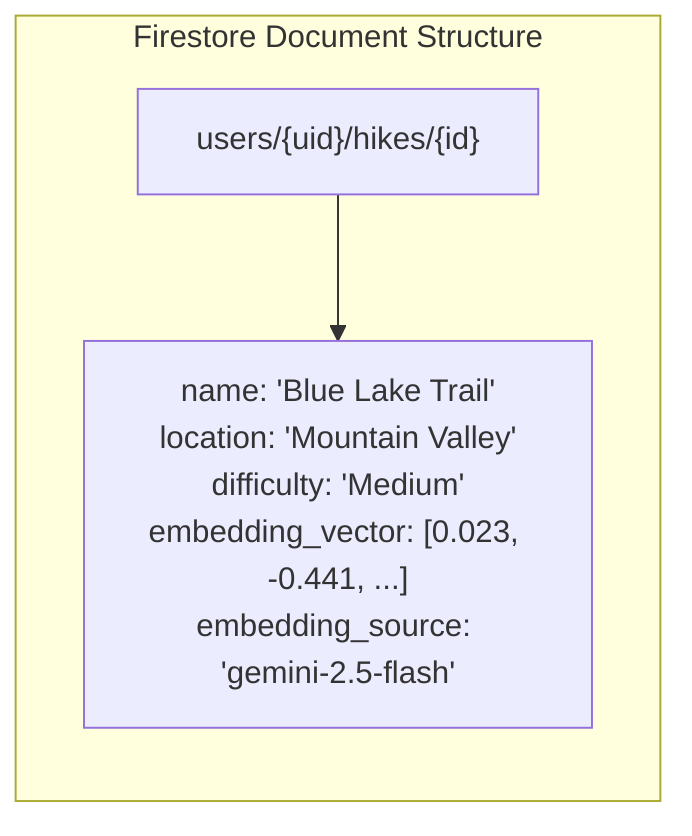

This **co-located storage** approach has several advantages:
- **Single query retrieval**: Both metadata and vectors are fetched in one read operation
- **Atomic updates**: When a hike is modified, its embedding updates in the same transaction
- **Simplified architecture**: No need for a separate vector database like Pinecone or Weaviate

#### Conservative Rate Limiting

The pipeline is designed to be "quota-friendly" for the Gemini API:

```java
// VectorSyncManager - Sequential processing to avoid rate limits
public Task<Void> syncUserVectors(int userId, String firebaseUid) {
    if (!embeddingService.isConfigured()) {
        Log.d(TAG, "Gemini API key missing; skipping vector sync");
        return Tasks.forResult(null);  // Graceful degradation
    }
    if (!NetworkUtils.isOnline(appContext)) {
        return Tasks.forResult(null);  // Skip when offline
    }
    // Process sequentially, not in parallel
    return Tasks.call(executorService, () -> {
        performVectorSync(userId, firebaseUid);
        return null;
    });
}
```

**Design decision**: Embeddings are generated **sequentially** (not in parallel) to avoid hitting API rate limits. This trades speed for reliability—a crucial consideration for a production application.

---

### 6.2 Dual Authentication Architecture

M-Hike implements a sophisticated **Dual Identity System** that bridges local Room storage with Firebase cloud authentication. This enables the application to work fully offline whilst maintaining secure cloud synchronisation.

#### The Two-ID Problem

Every user has **two different identifiers**:

| ID Type | Storage | Purpose |
|---------|---------|---------|
| `userId` (int) | Local Room Database | Primary key for local relationships |
| `firebaseUid` (string) | Firebase Auth & Firestore | Cloud document paths and security |

The `SessionManager` maintains both simultaneously:

```java
public class SessionManager {
    private static final String KEY_USER_ID = "user_id";        // Local Room ID
    private static final String KEY_FIREBASE_UID = "firebase_uid";  // Cloud ID

    public static void setCurrentUserId(Context context, int userId) {
        prefs.edit().putInt(KEY_USER_ID, userId).apply();
    }

    public static void setCurrentFirebaseUid(Context context, String firebaseUid) {
        prefs.edit().putString(KEY_FIREBASE_UID, firebaseUid).apply();
    }
}
```

#### The Registration Flow

When a user signs up, both identity systems must be initialised in the correct order:

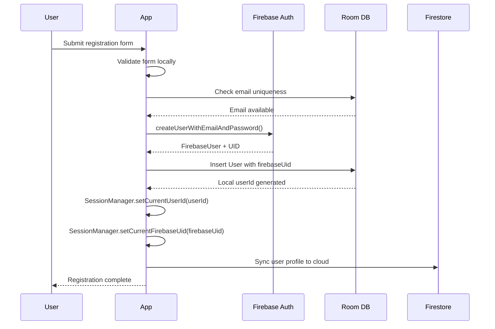

**Critical ordering**: Firebase Auth must succeed **before** creating the local Room user. This ensures we have the `firebaseUid` to store in the local entity, enabling future sync operations.

#### Why Not Just Use Firebase?

A common question is: "Why maintain a local Room database at all?"

| Scenario | Firebase-Only | M-Hike's Dual System |
|----------|---------------|----------------------|
| No internet connection | ❌ App unusable | ✅ Full functionality |
| Slow/flaky connection | ⚠️ Sluggish UI | ✅ Instant responses |
| Data ownership | ⚠️ Google's servers | ✅ Local copy guaranteed |
| Query performance | ⚠️ Network latency | ✅ Millisecond queries |

The Dual Authentication Architecture provides the best of both worlds: local speed and reliability with cloud backup and cross-device sync.

---

### 6.3 Multi-Selection Mode with State Management

The `HikeListAdapter` implements a sophisticated **stateful selection system** that demonstrates proper Android RecyclerView state management patterns.

#### The Selection State Machine

The adapter maintains a `Set<Integer>` of selected hike IDs, enabling O(1) lookup for selection state:

```java
public class HikeListAdapter extends RecyclerView.Adapter<HikeViewHolder> {
    private boolean selectionMode = false;
    private final Set<Integer> selectedHikeIds = new HashSet<>();

    public void setSelectionMode(boolean enabled) {
        selectionMode = enabled;
        if (!selectionMode) {
            selectedHikeIds.clear();  // Reset on mode exit
        }
        notifyDataSetChanged();  // Trigger full rebind
    }
}
```

#### Visual State Binding

Each ViewHolder dynamically adjusts its appearance based on both mode and selection state:

```java
void bind(Hike hike) {
    // ... basic data binding ...

    if (selectionMode) {
        // SELECTION MODE: Show checkboxes, disable navigation
        selectCheckbox.setVisibility(View.VISIBLE);
        boolean isSelected = selectedHikeIds.contains(hike.getHikeID());
        selectCheckbox.setChecked(isSelected);
        viewButton.setEnabled(false);
        viewButton.setAlpha(0.5f);  // Visual disabled state

        // Unified click handler for the entire row
        View.OnClickListener toggleListener = v -> toggleSelection(hike);
        itemView.setOnClickListener(toggleListener);
        selectCheckbox.setOnClickListener(toggleListener);
        viewButton.setOnClickListener(toggleListener);
    } else {
        // NORMAL MODE: Hide checkboxes, enable navigation
        selectCheckbox.setVisibility(View.GONE);
        viewButton.setEnabled(true);
        viewButton.setAlpha(1f);
        itemView.setOnClickListener(v -> listener.onHikeClicked(hike));
    }
}
```

#### The Observer Pattern for Selection Changes

The adapter notifies the Activity when selection count changes, enabling dynamic UI updates:

```java
public interface OnSelectionChangedListener {
    void onSelectionChanged(int selectedCount);
}

private void toggleSelection(Hike hike) {
    int id = hike.getHikeID();
    if (selectedHikeIds.contains(id)) {
        selectedHikeIds.remove(id);
    } else {
        selectedHikeIds.add(id);
    }

    // Notify observer (the Activity)
    if (selectionChangedListener != null) {
        selectionChangedListener.onSelectionChanged(selectedHikeIds.size());
    }
    notifyDataSetChanged();
}
```

The Activity responds by enabling/disabling the "Delete Selected" button:

```java
// HikingListActivity.java
adapter.setOnSelectionChangedListener(count -> {
    deleteSelectedButton.setEnabled(count > 0);
});
```

---

### 6.4 Thread Safety and Concurrency Patterns

M-Hike employs multiple concurrency strategies to ensure thread-safe database operations without blocking the UI thread.

#### The Single-Threaded Executor Pattern

Critical managers use **SingleThreadExecutor** to serialize operations:

```java
// FirebaseSyncManager - Guaranteed sequential execution
private final ExecutorService executorService = Executors.newSingleThreadExecutor();

public void syncNow(SyncCallback callback) {
    executorService.execute(() -> {
        // All database reads happen sequentially
        List<Hike> unsyncedHikes = hikeDao.getUnsyncedHikes();
        // No race conditions possible
    });
}
```

**Why single-threaded?** The Firebase sync involves:
1. Reading from Room (local)
2. Writing to Firestore (cloud)
3. Updating Room again (marking as synced)

If these operations ran in parallel, hikes could be uploaded twice or marked as synced before the upload completed.

#### Main Thread Executor for UI Updates

After background work completes, results must be posted back to the UI thread:

```java
private final Executor mainThreadExecutor = ContextCompat.getMainExecutor(appContext);

private void notifySuccess(SyncCallback callback) {
    mainThreadExecutor.execute(() -> {
        callback.onSuccess();  // Safe to update UI here
    });
}
```

#### The Task Aggregation Pattern

Firebase SDK returns `Task<Void>` objects. M-Hike aggregates multiple async operations using `Tasks.whenAllSuccess()`:

```java
List<Task<Void>> pendingTasks = new ArrayList<>();
pendingTasks.add(syncUserProfile(userId, firebaseUid));
pendingTasks.addAll(syncHikes(userId, firebaseUid));
pendingTasks.addAll(syncObservations(userId, firebaseUid));

// Wait for ALL operations to complete
Tasks.whenAllSuccess(pendingTasks)
    .addOnSuccessListener(unused -> notifySuccess(callback))
    .addOnFailureListener(e -> notifyFailure(callback, e));
```

This ensures the logout sequence only clears local data **after** all cloud writes have succeeded.

---

### 6.5 Relevance Scoring Algorithm

The `SearchHelper` implements a **multi-factor relevance scoring system** that ranks search results beyond simple string matching.

#### Score Calculation Logic

Each hike receives a cumulative score based on multiple criteria:

```java
private static int calculateRelevanceScore(Hike hike, String query) {
    int score = 0;

    // TIER 1: Exact matches (highest value)
    if (name.equals(query)) score += 100;
    if (location.equals(query)) score += 80;

    // TIER 2: Prefix matches
    if (name.startsWith(query)) score += 50;
    if (location.startsWith(query)) score += 40;

    // TIER 3: Contains matches
    if (name.contains(query)) score += 30;
    if (location.contains(query)) score += 25;
    if (description.contains(query)) score += 15;
    if (difficulty.contains(query)) score += 10;

    // TIER 4: Word-by-word matching (multi-word queries)
    for (String word : queryWords) {
        if (name.contains(word)) score += 10;
        if (location.contains(word)) score += 8;
    }

    // TIER 5: Fuzzy matching (typo tolerance)
    for (String nameWord : nameWords) {
        int distance = levenshteinDistance(nameWord, query);
        if (distance <= FUZZY_THRESHOLD) {
            score += (FUZZY_THRESHOLD - distance) * 5;
        }
    }

    return score;
}
```

#### The Scoring Hierarchy Visualised

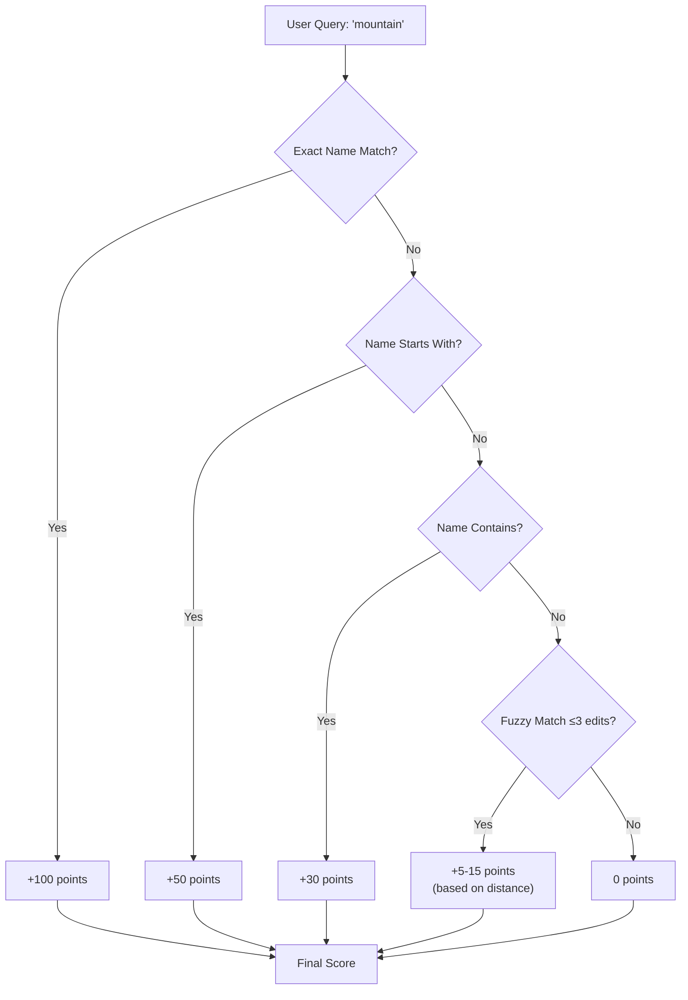

#### Why This Matters for UX

Consider the query "mountan" (misspelled):

| Hike Name | Contains Match | Fuzzy Match | Total Score |
|-----------|---------------|-------------|-------------|
| Mountain Peak Trail | ❌ | ✅ (distance=1) | 10 |
| Mount Everest | ❌ | ✅ (distance=2) | 5 |
| Lake Valley | ❌ | ❌ | 0 |

The fuzzy matching ensures typos don't result in zero results—a critical UX consideration for mobile keyboards where typing errors are common.

---

### 6.6 Room Type Converters for Complex Types

SQLite (the underlying database for Room) doesn't natively support Java `Date` objects. The `Converters` class bridges this gap.

#### The Conversion Mechanism

```java
public class Converters {
    @TypeConverter
    public static Date fromTimestamp(Long value) {
        return value == null ? null : new Date(value);
    }

    @TypeConverter
    public static Long dateToTimestamp(Date date) {
        return date == null ? null : date.getTime();
    }
}
```

#### How Room Uses Converters

When Room encounters a `Date` field in an entity:

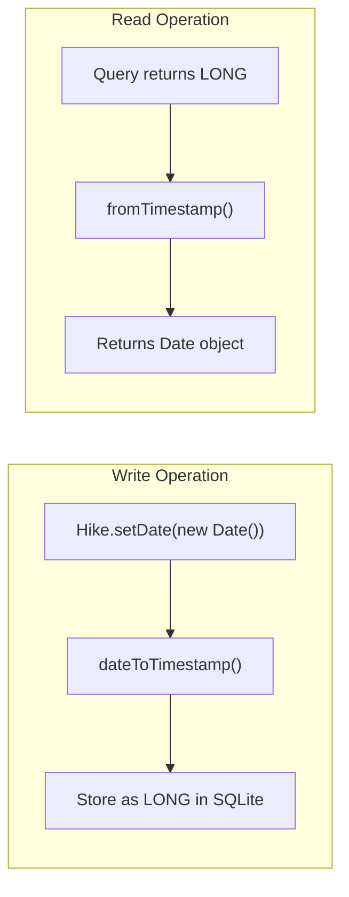

The `@TypeConverters({Converters.class})` annotation on `AppDatabase` registers these converters globally.

---

### 6.7 Cascade Deletion with Foreign Keys

The `Observation` entity demonstrates proper relational database design with **referential integrity enforcement**.

#### The Foreign Key Definition

```java
@Entity(tableName = "observations",
        foreignKeys = @ForeignKey(
                entity = Hike.class,
                parentColumns = "hikeID",
                childColumns = "hikeId",
                onDelete = ForeignKey.CASCADE  // KEY: Automatic cleanup
        ),
        indices = {@Index("hikeId")})
public class Observation {
    private int hikeId;  // References Hike.hikeID
}
```

#### What CASCADE Means

When a Hike is deleted, **all its Observations are automatically deleted** by SQLite:

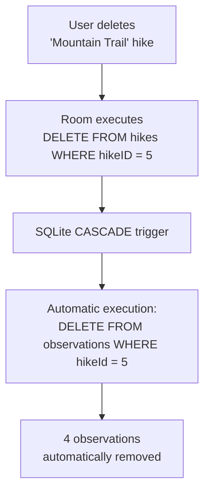

**Benefits**:
- **No orphaned records**: Observations can't exist without their parent Hike
- **Atomic deletion**: If the Hike delete fails, Observations remain intact
- **Simplified code**: No need to manually delete child records first

---

### 6.8 Active Hike Real-Time Tracking

The application tracks whether the user is currently on an active hike, displaying elapsed time on the home screen.

#### The Active State Fields

```java
@Entity(tableName = "hikes")
public class Hike {
    private Boolean isActive;   // Currently on this hike?
    private Long startTime;     // When did the hike begin?
    private Long endTime;       // When did the hike end?
}
```

#### Ensuring Single Active Hike

Only one hike can be active at a time. The DAO enforces this:

```java
@Dao
public interface HikeDao {
    // Deactivate ALL hikes before starting a new one
    @Query("UPDATE hikes SET isActive = 0, synced = 0 WHERE isActive = 1")
    void deactivateAllHikes();

    // Then activate the specific hike
    @Query("UPDATE hikes SET isActive = 1, startTime = :startTime WHERE hikeID = :hikeId")
    void startHike(int hikeId, long startTime, long updatedAt);

    // Find the currently active hike (for home screen display)
    @Query("SELECT * FROM hikes WHERE isActive = 1 LIMIT 1")
    Hike getActiveHike();
}
```

#### Real-Time Duration Calculation

The home screen dynamically calculates elapsed time:

```java
private void loadActiveHike() {
    executorService.execute(() -> {
        Hike activeHike = hikeDao.getActiveHike();
        runOnUiThread(() -> {
            if (activeHike != null && activeHike.getStartTime() != null) {
                long durationMillis = System.currentTimeMillis() - activeHike.getStartTime();
                long hours = durationMillis / (1000 * 60 * 60);
                long minutes = (durationMillis / (1000 * 60)) % 60;

                activeHikeDuration.setText(
                    String.format("Started %dh %dm ago", hours, minutes)
                );
            }
        });
    });
}
```

This provides users with immediate awareness of their hiking activity without requiring manual time tracking.

---

## References

Firtman, M. (2018) *High Performance Mobile Web: Best Practices for Optimizing Mobile Web Apps*. Sebastopol: O'Reilly Media.

Fowler, M. (2002) *Patterns of Enterprise Application Architecture*. Boston: Addison-Wesley Professional.

Google (2024a) *Room Persistence Library*. Available at: https://developer.android.com/training/data-storage/room (Accessed: 28 November 2024).

Google (2024b) *Cloud Firestore Documentation*. Available at: https://firebase.google.com/docs/firestore (Accessed: 28 November 2024).

Google (2024c) *Firebase Authentication*. Available at: https://firebase.google.com/docs/auth (Accessed: 28 November 2024).

Google (2024d) *Gemini API - Embeddings Guide*. Available at: https://ai.google.dev/gemini-api/docs/embeddings (Accessed: 28 November 2024).

Manning, C.D., Raghavan, P. and Schütze, H. (2008) *Introduction to Information Retrieval*. Cambridge: Cambridge University Press.

Navarro, G. (2001) 'A Guided Tour to Approximate String Matching', *ACM Computing Surveys*, 33(1), pp. 31-88. doi: 10.1145/375360.375365.

Nielsen, J. (1994) 'Enhancing the Explanatory Power of Usability Heuristics', *Proceedings of the SIGCHI Conference on Human Factors in Computing Systems*. Boston, MA, 24-28 April. New York: ACM Press, pp. 152-158.

Ramírez, S. (2024) *FastAPI Documentation*. Available at: https://fastapi.tiangolo.com/ (Accessed: 28 November 2024).

Gamma, E., Helm, R., Johnson, R. and Vlissides, J. (1994) *Design Patterns: Elements of Reusable Object-Oriented Software*. Boston: Addison-Wesley Professional.

Goetz, B., Peierls, T., Bloch, J., Bowbeer, J., Holmes, D. and Lea, D. (2006) *Java Concurrency in Practice*. Boston: Addison-Wesley Professional.

Mikolov, T., Chen, K., Corrado, G. and Dean, J. (2013) 'Efficient Estimation of Word Representations in Vector Space', *Proceedings of the International Conference on Learning Representations (ICLR)*. Scottsdale, AZ, 2-4 May.

Codd, E.F. (1970) 'A Relational Model of Data for Large Shared Data Banks', *Communications of the ACM*, 13(6), pp. 377-387. doi: 10.1145/362384.362685.

---

## Appendix: Project Structure

```
M-Hike/
├── app/
│   ├── src/main/java/com/example/mobilecw/
│   │   ├── activities/          # UI Activities
│   │   ├── adapters/            # RecyclerView Adapters
│   │   ├── auth/                # Session Management
│   │   ├── database/            # Room Database
│   │   │   ├── dao/             # Data Access Objects
│   │   │   └── entities/        # Entity Classes
│   │   ├── services/            # API Services
│   │   ├── sync/                # Firebase & Vector Sync
│   │   └── utils/               # Utilities
│   └── src/main/res/            # Android Resources
├── backend/
│   ├── main.py                  # FastAPI Server
│   └── requirements.txt         # Python Dependencies
└── README.md                    # This Report
```

---

## Summary

This coursework demonstrates the successful implementation of a comprehensive hiking management application that extends significantly beyond the basic CRUD requirements. Key achievements include:

1. **Offline-First Architecture**: The application functions fully without internet connectivity, with seamless cloud synchronisation when online
2. **AI-Powered Search**: Integration of Gemini 2.5 Flash embeddings enables semantic search capabilities that understand context, not just keywords
3. **Microservices Design**: Separation of the embedding/search logic into a Python backend demonstrates modern distributed system design
4. **Robust Security**: Multi-layered security including Firebase Authentication, user data isolation, and secure session management
5. **Advanced Algorithms**: Implementation of Levenshtein distance for fuzzy search and cosine similarity for vector comparison
6. **Thread-Safe Concurrency**: Proper use of ExecutorService patterns ensures responsive UI whilst performing complex background operations

The M-Hike application represents a production-ready foundation that could be deployed with the enhancements outlined in Section 4.iv.

---

*This report was prepared as part of the COMP1786 Mobile Application Design and Development coursework.*
